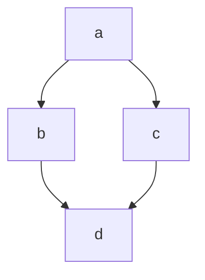

# markdown
 
 
# titulo = h1
## titulo = h2
### titulo = h3
#### titulo = h4
##### titulo = h5
###### titulo = h6
 
Parágrafo normal
 
Se você der espaços
entre linhas, então você
terá um novo parágrafo.
 
Quebra de linha  
com dois espaços  
ao final da linha. <br> é o mesmo \<br> que você encontra no html
 
**negrito**
__negrito__
==marcado==
sublinhado
~~riscado~~
*italico*
_italico_
 
Em um **paragrafo** podemos usar todos os anteriores
 
## Lista
 
1. ordenadas
2. quando você usa um numero , o
3.proximo item será automaticamente incrementados
    1. subitem
    2. outro sunitem
    2. outro subitem
        1.sub subitem
 
- Não ordenadas
* Você pode usar um asterisco ou hifen
+ sinal de mais também é aceito
 
##### Só com o mesmo sinal
- Não ordenadas
- Você pode usar um asterisco ou hifen
- sinal de mais também é aceito
    - subitem
    - subitem
    - subitem
- O correto é não misturar os sinais
 
## Links
[]()

<a href="https://senac.br">

[Clique aqui](https://senac.br/)

[GIT](https://github.com/Sh1mizut/TDS01)

[ancora](#markdown)
[listas](#listas)

Aqui é um parágrafo com link [Clique aqui](https://senac.br/ "Titulo para esse link") ou aqui é um paragrafo ocm link  https://senac.br/

[Clique aqui](https://senac.br/ "Site SENAC")

[texto](link "Titulo")

## imagens


## imagem com link
[]()

[](https://gmail.com)


[](https://google.com)

## citação

> Iniciar minha citação

> <br>
>Iniciar minha citação
> <br><br>

>Citação
>>Sub citação

>### Titulo dentro de uma citação

## toggle
<details>
    <summary>
    Clique aqui para ver o conteúdo
    </summary>
    Conteúdo
</details>

## separador

pode ser 3 traços

---

ou pode ser 3 asteriscos

***

## checklist

- [ ] ITEM 1
- [ ] ITEM 2
- [ ] ITEM 3

## tabela

| nome | idade |
| ---- | ----- |
|Diego |   33  |
|Queren|   22  |

| nome | idade |
| ---- | -----: |
|Diego |   33  |
|Queren|   22  |

| nome | idade |
| ---- | :-----: |
|Diego |   33  |
|Queren|   22  |

## código

Em linha usamos 1 acento grave para abrir o código e outro para fechar

` <h1> Eu sou um título</h1>`
<h1> Eu sou um título</h1>

`# Eu sou um Titulo `

# Eu sou um Titulo

`console.log('Olá, mundo!')`

### bloco de código

Usaremos 3 acentos graves para abrir, seguido da linguagem que eu quero, e para fechar mais 3 acentos graves.

``` html
<details>
    <summary>
    Clique aqui para ver o conteúdo
    </summary>
    Conteúdo
</details>

```

```css

.container{
    display:flex
    }

```

``` javascript

console.log('Olá, mundo!');

function dados(dados){
    console.log(dados);
}

```

## emojis

:rocket:
:smirk:
:elephant:
:s
:D




<!-- Comentário M-->